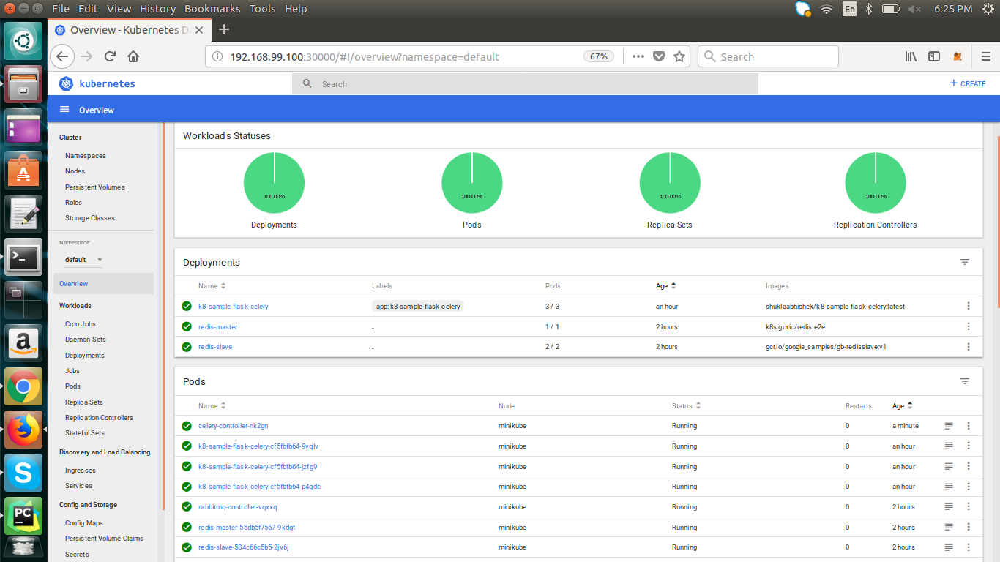

#ON Local

## Download minikube and start 

minikube start
minikube dashboard

On Local
-------------------

``` 
minikube start
minikube dashboard
```

Deploying all services
--------------------------

```
kubectl create -f deploy/kubernetes/infra/rabbitmq
kubectl create -f deploy/kubernetes/infra/redis
kubectl create -f deploy/kubernetes/webapp/
kubectl create -f deploy/kubernetes/webcelery/

```




### Listing pods on cluster:
```
kubectl get pods --all-namespaces
```

## Getting logs of application labels
```
kubectl logs -lapp=taskQueue

```

##Listing all pods
```
kubectl get pod 
```

## Shell on a container
```
kubectl exec -it rabbitmq-controller-vqxxq -- /bin/sh
```